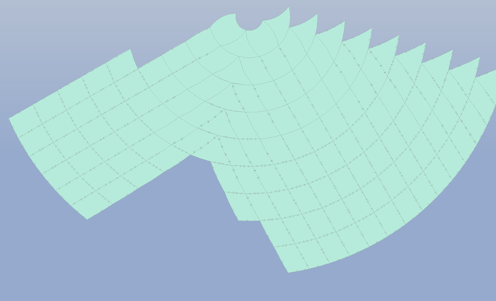

# ArcticGrids
Examples of grids which may be suitable for the Arctic Region.

This repository holds data coverage and example content for three different tiling schemes.

* Rectilinear Grid
* DGGS ISEAH3 (Hexagonal)
* rHealPix DGGS (irregular isolatitude DGGS)

The data folder contains data in both Shape and auto-generated S-57 ENC cells. Each folder contains more information on the test data presented and some background to the tiling scheme it defines.

